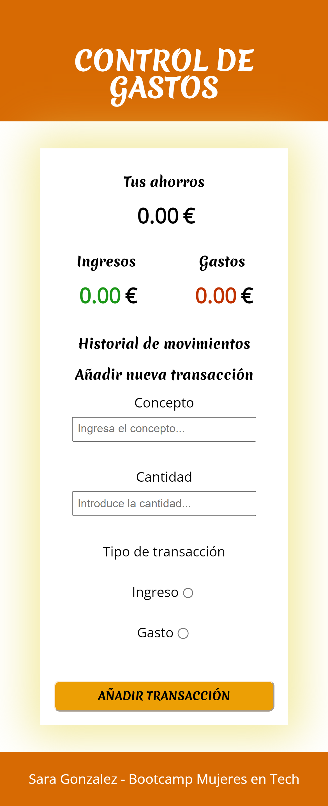
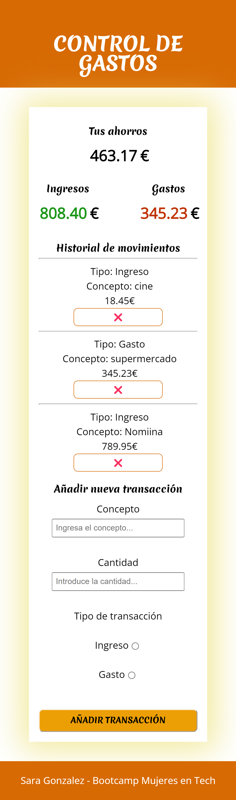

## Control de gastos - 
#### Práctico del Modulo Javascript desde el Navegadora del Bootcamp Mujeres en Tech, de KeepCoding y Glovo

Se desarrolló una web para gestionar nuestros ingresos y gastos, con el objetivo de conocer el dinero que tenenos ahorrado. La app es web responsive.

## Requisitos indispensables que cumple:
1. La aplicación muestra en todo momento el total de gastos, ingresos y el dinero total que tenemos ahorrado.
1. Se puede añadir un ingreso o un gasto incluyendo un concepto.
1. Se puede borrar cualquier gasto o ingreso que hayamos introducido.

## Requisitos opcionales
1. Si cerramos la web y volvemos a entrar, tenemos que recuperar todos los gastos e ingresos que habíamos introducido, así como el ahorro total.

## Ejemplo

